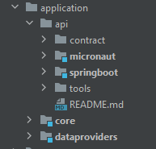

# Inventory

This application does nothing more that an exercises to apply two concepts: Code Clean architecture and API Contract
First

I took the Code Clean architecture idea from this [repo](https://github.com/mattia-battiston/clean-architecture-example)
. It's a good example and have a lot of resources to check

## Application

It's a maven monorepo with the application split in several layers.

* Core: keep all the business layer
* Dataproviders: keep the layer in charge of data persistence
* Api: the different delivery layers implemented. The idea is to have different layers with different technologies like
  exercise: REST API, gRPC, GraphQL and different frameworks.



## API Contract First

For the exercise of autoimmunization of from API contract go [here](application/api/README.md)

## Compile and run

The tools that I have used and the specific versions:

* [Apache Maven](https://maven.apache.org/) 3.8.4
* [Java Openjdk](https://openjdk.org/) 11.0.14
* Postman

Compile with next command:

```shell
mvn clean install
```

You can run the application with different API technologies.

### Run with Spring Boot

```shell
 mvn -f ./application/api/springboot/pom.xml spring-boot:run
```

### Run with micronaut

```shell
 mvn -f ./application/api/micronaut/pom.xml mn:run
```

